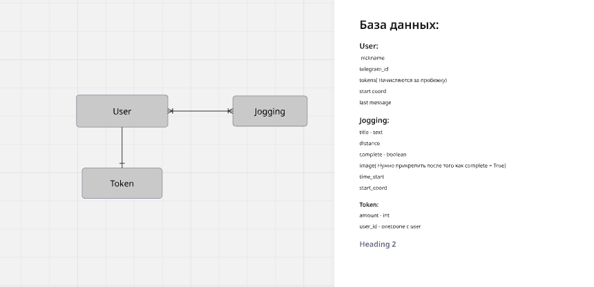

# TG_RUN_Bot

## 📃 О проекте

Проект представляет собой небольшую платформу с мини-играми, в которых вам предстоит разгададывать тайны и загадки, следуя сценарию и попутно веселиться! 😊

Но будьте осторожны, в игре присутсвуют безобидные скримеры, со странными, а где-то весёлыми эффектами 😜

### 🌐 Проект поддерживает на данный момент **один язык**

- **Русский**

## 🛠 Технологии

**Backend:**

- python-telegram-bot

**Frontend:**

- HTML & CSS

## 🚀 Быстрый старт

### Требования

- Python 3.11
- Операционная система: Linux, macOS или Windows.
- Интерпретатор Python: Версии 3.7 или выше.
- Git

## Установка и запуск

### Клонирование репозитория

```bash
git clone https://github.com/Vova1707/TG_RUN_BOT.git
```

#### Перейти в директорию "ТГ-БОТ"

```bash
cd ТГ-БОТ
```

### Создание и активация виртуального окружения

#### Создание виртуального окружения

```bash
python -m venv venv # Для Windows
python3 -m venv venv # Для MacOS и Linux
```

#### Активация виртуального окружения

```bash
venv\Scripts\activate # Для Windows
source venv/bin/activate # Для MacOS и Linux
```

### Настройка переменных окружения

- Скопируйте `template.env` в `.env`:

    ```bash
    cp template.env .env    # macOS и Linux
    copy template.env .env   # Windows
    ```

- Отредактируйте `.env` и задайте корректные значения для переменных.

### Установка зависимостей для запуска проекта


### Примените миграции к базе данных

```bash
alembic upgrade head
```

### Запуск сервера

```bash
python -m bot_api.main
```

## Тестирование 🧑‍🔧

#### Запуск тестов 📝

```bash
Будет позже
```

## Разработка 🛠️

### Структура базы данных в виде ER-диграммы🖼️



## Что делать дальше, решаете только вы, удачи! ❣️
